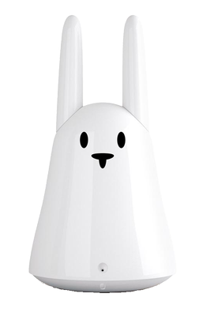

# OpenKarotz-Android

[](https://developer.android.com/)
[](https://android-arsenal.com/api?level=24)
[](https://opensource.org/licenses/MIT)

**Updated and modernized version of Olivier Bagot's OpenKarotz-Android app**

A modern Android application to control multiple Karotz devices running OpenKarotz firmware. This version brings the original 2014 app to modern Android standards with multi-device support, updated UI, and contemporary development practices.



## ✨ What's New in This Version

### 🚀 **Modern Android Development**
- **Android API 34** - Latest Android target
- **Material Design 3** - Modern UI components
- **AndroidX Libraries** - Latest Android architecture
- **Gradle Build System** - Modern build tools
- **MVVM Architecture** - Clean code structure

### 🐰 **Multi-Karotz Support**
- **Multiple Device Management** - Connect to several Karotz devices
- **Device Switching** - Easily switch between your Karotz collection
- **Status Monitoring** - Real-time online/offline status
- **Device Discovery** - Automatic network scanning (planned)

### 🌐 **Enhanced Networking**
- **Retrofit Integration** - Modern REST API client
- **Improved Error Handling** - Better connection management
- **Async Operations** - Non-blocking UI operations
- **Network Security** - Modern Android security compliance

### 💾 **Data Management**
- **Room Database** - Local device configuration storage
- **LiveData** - Reactive UI updates
- **Repository Pattern** - Clean data access layer

## 📱 Features

- **🎨 LED Control** - Change colors and pulsing effects
- **👂 Ear Movement** - Control left/right ear positions
- **🎵 Sound Playback** - Stream audio to your Karotz
- **📻 Internet Radio** - 80+ French radio stations included
- **😴 Sleep/Wake** - Power management
- **⚙️ System Control** - Device status and version info
- **🔧 Device Management** - Add, edit, and organize multiple Karotz
- **📊 Status Monitoring** - Real-time device health

## 🛠️ Requirements

- **Android 7.0+ (API 24)**
- **OpenKarotz firmware** on your Karotz device(s)
- **Network connection** to reach your Karotz

## 📥 Installation

### From Releases
1. Download the latest APK from [Releases](https://github.com/Wulfaz/OpenKarotz-Android/releases)
2. Install on your Android device
3. Add your Karotz devices in Settings

### Building from Source
```bash
git clone https://github.com/Wulfaz/OpenKarotz-Android.git
cd OpenKarotz-Android
./gradlew assembleDebug
```

## 🚀 Quick Start

1. **Add Your First Karotz**
   - Open the app
   - Tap "Manage Devices" 
   - Add your Karotz IP address and name

2. **Control Your Karotz**
   - Use the navigation drawer to access features
   - Change LED colors in the "Color" section
   - Move ears in the "Ears" section
   - Play radio in the "Radio" section

3. **Multiple Devices**
   - Add more Karotz devices
   - Switch between them easily
   - Set a default device

## 🔧 Configuration

The app stores device configurations locally using Room database. Each device entry includes:
- Device name
- Hostname/IP address  
- Port (default: 9123)
- Online status
- Last seen timestamp

## 🤝 Contributing

Contributions are welcome! Please feel free to:
- Report bugs
- Suggest new features
- Submit pull requests
- Improve documentation

## 📚 OpenKarotz Resources

- [OpenKarotz Official Site](http://openkarotz.filippi.org/)
- [OpenKarotz Documentation](http://openkarotz.filippi.org/wiki/)
- [Original Project](https://github.com/hobbe/OpenKarotz-Android) by Olivier Bagot

## 🏆 Credits

### Original Author
**Olivier Bagot** ([hobbe](https://github.com/hobbe)) - Created the original OpenKarotz-Android application in 2014

### Modernization & Enhancement  
**Wulfaz** ([Wulfaz](https://github.com/Wulfaz)) - 2025 modernization with multi-device support and contemporary Android practices

## 📄 License

This project is licensed under the MIT License - see the [LICENSE](LICENSE) file for details.

```
Copyright (c) 2014 Olivier Bagot (Original work)
Copyright (c) 2025 Wulfaz (Modernization and enhancements)
```

## 🐛 Issues & Support

If you encounter any issues or have questions:
1. Check the [Issues](https://github.com/Wulfaz/OpenKarotz-Android/issues) page
2. Create a new issue with details about your problem
3. Include your Android version and device model

---

*Made with ❤️ for the Karotz community*
